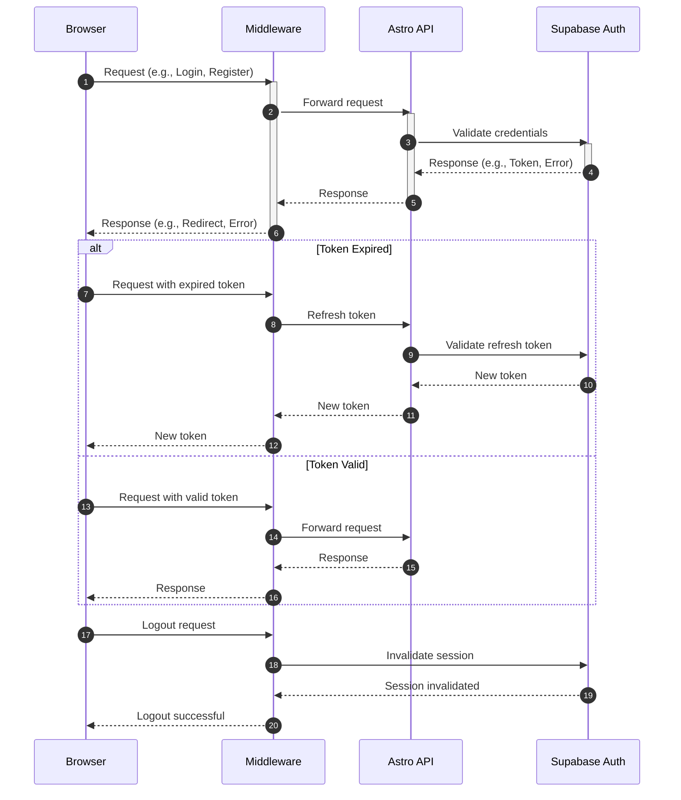

<authentication_analysis>

1. **Authentication Flows**:

    - Registration
    - Login
    - Password Recovery
    - Password Reset
    - Logout

2. **Key Actors**:

    - Browser
    - Middleware
    - Astro API
    - Supabase Auth

3. **Token Verification and Refresh**:

    - Tokens are validated for each request.
    - Refresh tokens are used to maintain sessions, with rotation enabled for added security.

4. **Steps in the Authentication Process**:
    - User interacts with the frontend (e.g., submits login form).
    - Middleware checks authentication state and forwards requests to the Astro API.
    - Astro API communicates with Supabase Auth for user validation.
    - Supabase Auth processes the request and returns a response (e.g., token, error).
    - Middleware handles session management and redirects as needed.
      </authentication_analysis>

<mermaid_diagram>

</mermaid_diagram>
