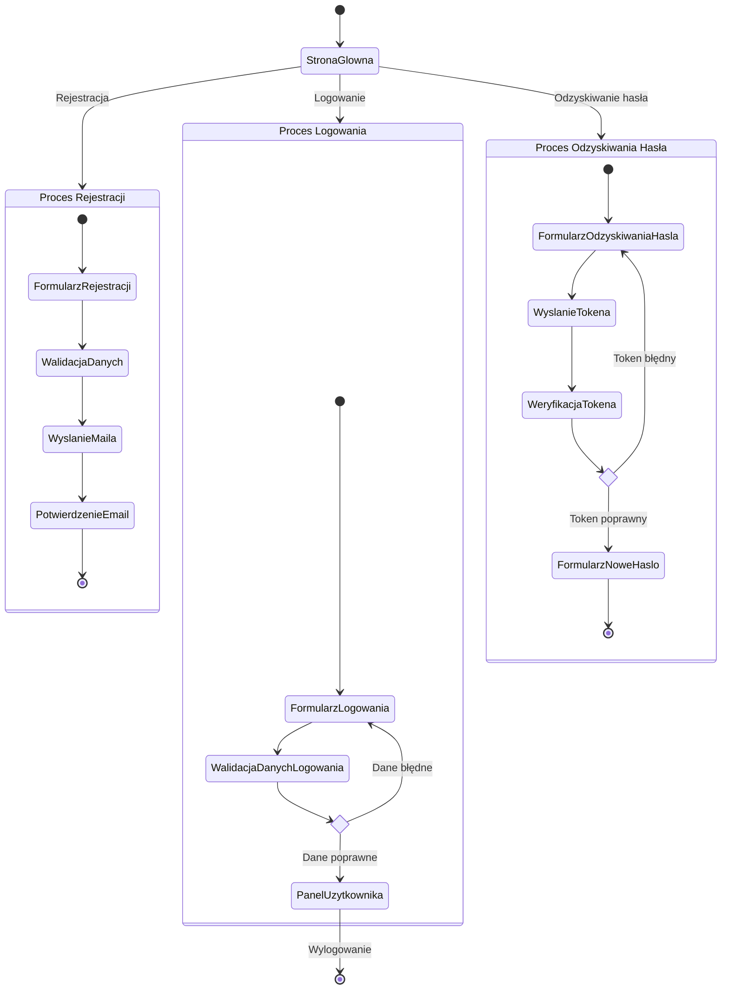

<user_journey_analysis>

1. **Ścieżki użytkownika**:

    - Rejestracja nowego konta.
    - Logowanie do istniejącego konta.
    - Odzyskiwanie hasła.
    - Wylogowanie.

2. **Główne podróże i stany**:

    - Strona główna (niezalogowany użytkownik).
    - Formularz rejestracji.
    - Formularz logowania.
    - Formularz odzyskiwania hasła.
    - Weryfikacja tokena (dla odzyskiwania hasła).
    - Panel użytkownika (zalogowany użytkownik).

3. **Punkty decyzyjne i alternatywne ścieżki**:

    - Czy dane logowania są poprawne?
    - Czy token weryfikacyjny jest poprawny?
    - Czy użytkownik potwierdził rejestrację przez e-mail?

4. **Opis celu każdego stanu**:
    - **Strona główna**: Punkt startowy dla niezalogowanego użytkownika.
    - **Formularz rejestracji**: Umożliwia utworzenie nowego konta.
    - **Formularz logowania**: Umożliwia dostęp do konta użytkownika.
    - **Formularz odzyskiwania hasła**: Pozwala użytkownikowi zainicjować proces resetowania hasła.
    - **Weryfikacja tokena**: Sprawdza poprawność tokena resetującego hasło.
    - **Panel użytkownika**: Główne miejsce zarządzania kontem i fiszkami dla zalogowanego użytkownika.
      </user_journey_analysis>

<mermaid_diagram>

</mermaid_diagram>
