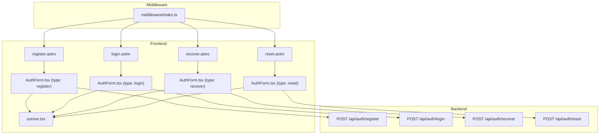

<architecture_analysis>

1. **Components Identified**:

    - Astro Pages: `register.astro`, `login.astro`, `recover.astro`, `reset.astro`.
    - React Components: `AuthForm.tsx`, `sonner.tsx`.
    - Middleware: `middleware/index.ts`.
    - Backend Endpoints: `/api/auth/register`, `/api/auth/login`, `/api/auth/recover`, `/api/auth/reset`.

2. **Main Pages and Corresponding Components**:

    - `register.astro`: Uses `AuthForm.tsx` with type `register`.
    - `login.astro`: Uses `AuthForm.tsx` with type `login`.
    - `recover.astro`: Uses `AuthForm.tsx` with type `recover`.
    - `reset.astro`: Uses `AuthForm.tsx` with type `reset`.

3. **Data Flow**:

    - User interacts with Astro pages.
    - Pages use `AuthForm.tsx` for form handling.
    - Form submissions are sent to backend endpoints.
    - Middleware validates authentication state and redirects unauthorized users.

4. **Component Descriptions**:
    - `AuthForm.tsx`: Handles form rendering and submission for authentication actions.
    - `sonner.tsx`: Displays notifications for success or error messages.
    - Middleware: Ensures secure access by validating user sessions.
    - Backend Endpoints: Handle registration, login, password recovery, and reset logic.
      </architecture_analysis>

<mermaid_diagram>

</mermaid_diagram>
